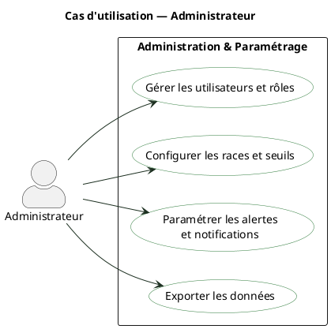

# Cas d'utilisation — Administrateur

> Coller le bloc PlantUML dans [planttext.com](https://www.planttext.com) pour générer l'image.

```plantuml
@startuml CasUtilisation_Administrateur
left to right direction
skinparam shadowing false
skinparam packageStyle rectangle
skinparam actorStyle awesome
skinparam usecase {
  BackgroundColor #FFFFFF
  BorderColor #2D7A3A
  ArrowColor #1B2E1F
}
title Cas d'utilisation — Administrateur

actor "Administrateur" as Admin

rectangle "Administration & Paramétrage" {
  usecase "Gérer les utilisateurs et rôles" as UC22
  usecase "Configurer les races et seuils" as UC23
  usecase "Paramétrer les alertes\net notifications" as UC24
  usecase "Exporter les données" as UC21
}

Admin --> UC22
Admin --> UC23
Admin --> UC24
Admin --> UC21

@enduml
```
