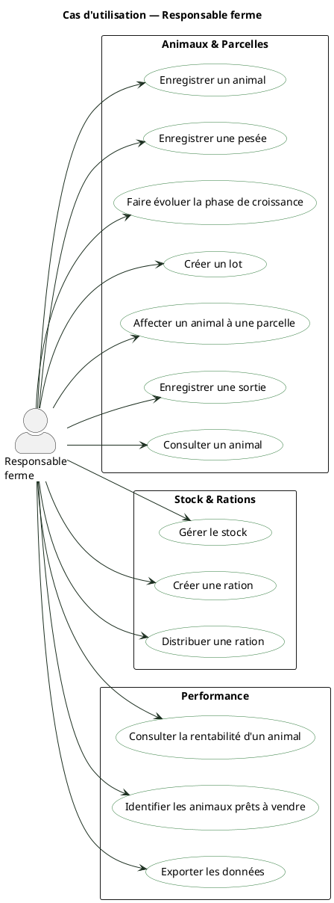

# Cas d'utilisation — Responsable ferme

> Coller le bloc PlantUML dans [planttext.com](https://www.planttext.com) pour générer l'image.

```plantuml
@startuml CasUtilisation_Responsable
left to right direction
skinparam shadowing false
skinparam packageStyle rectangle
skinparam actorStyle awesome
skinparam usecase {
  BackgroundColor #FFFFFF
  BorderColor #2D7A3A
  ArrowColor #1B2E1F
}
title Cas d'utilisation — Responsable ferme

actor "Responsable\nferme" as Resp

rectangle "Animaux & Parcelles" {
  usecase "Enregistrer un animal" as UC01
  usecase "Enregistrer une pesée" as UC02
  usecase "Faire évoluer la phase de croissance" as UC03
  usecase "Créer un lot" as UC04
  usecase "Affecter un animal à une parcelle" as UC05
  usecase "Enregistrer une sortie" as UC06
  usecase "Consulter un animal" as UC07
}

rectangle "Stock & Rations" {
  usecase "Gérer le stock" as UC08
  usecase "Créer une ration" as UC09
  usecase "Distribuer une ration" as UC10
}

rectangle "Performance" {
  usecase "Consulter la rentabilité d'un animal" as UC17
  usecase "Identifier les animaux prêts à vendre" as UC19
  usecase "Exporter les données" as UC21
}

Resp --> UC01
Resp --> UC02
Resp --> UC03
Resp --> UC04
Resp --> UC05
Resp --> UC06
Resp --> UC07
Resp --> UC08
Resp --> UC09
Resp --> UC10
Resp --> UC17
Resp --> UC19
Resp --> UC21

@enduml
```
