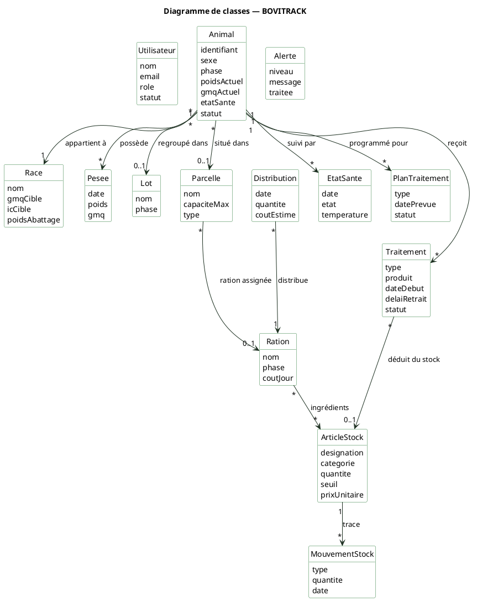

# Diagramme de classes — BOVITRACK

> Modèle de données simplifié de l'application de gestion de troupeau bovin.
> Coller le bloc PlantUML dans [planttext.com](https://www.planttext.com) pour générer l'image.

