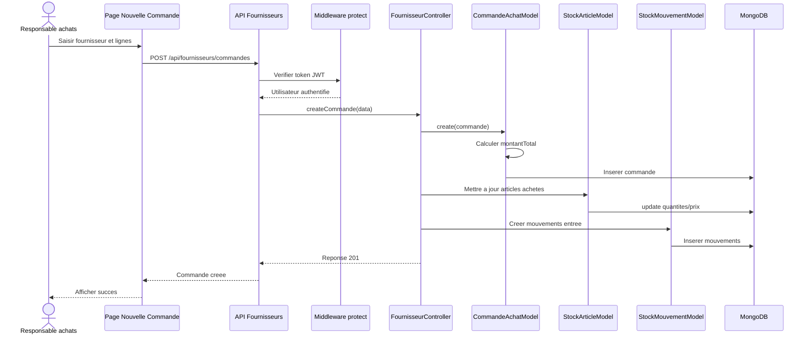

# Diagramme de sequence - Creation commande achat

```mermaid
sequenceDiagram
    actor Responsable as Responsable achats
    participant Frontend as Page Nouvelle Commande
    participant API as API Fournisseurs
    participant Middleware as Middleware protect
    participant Controller as FournisseurController
    participant Commande as CommandeAchatModel
    participant Stock as StockArticleModel
    participant Mouvement as StockMouvementModel
    participant DB as MongoDB

    Responsable->>Frontend: Saisir fournisseur et lignes
    Frontend->>API: POST /api/fournisseurs/commandes
    API->>Middleware: Verifier token JWT
    Middleware-->>API: Utilisateur authentifie
    API->>Controller: createCommande(data)
    Controller->>Commande: create(commande)
    Commande->>Commande: Calculer montantTotal
    Commande->>DB: Inserer commande
    Controller->>Stock: Mettre a jour articles achetes
    Stock->>DB: update quantites/prix
    Controller->>Mouvement: Creer mouvements entree
    Mouvement->>DB: Inserer mouvements
    Controller-->>API: Reponse 201
    API-->>Frontend: Commande creee
    Frontend-->>Responsable: Afficher succes
```

