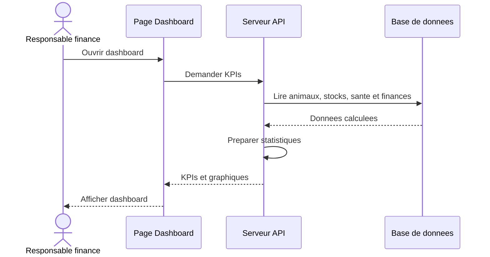

# Diagramme de sequence - Consultation dashboard

```mermaid
sequenceDiagram
    actor Responsable as Responsable finance
    participant Interface as Page Dashboard
    participant Serveur as Serveur API
    participant DB as Base de donnees

    Responsable->>Interface: Ouvrir dashboard
    Interface->>Serveur: Demander KPIs
    Serveur->>DB: Lire animaux, stocks, sante et finances
    DB-->>Serveur: Donnees calculees
    Serveur->>Serveur: Preparer statistiques
    Serveur-->>Interface: KPIs et graphiques
    Interface-->>Responsable: Afficher dashboard
```

