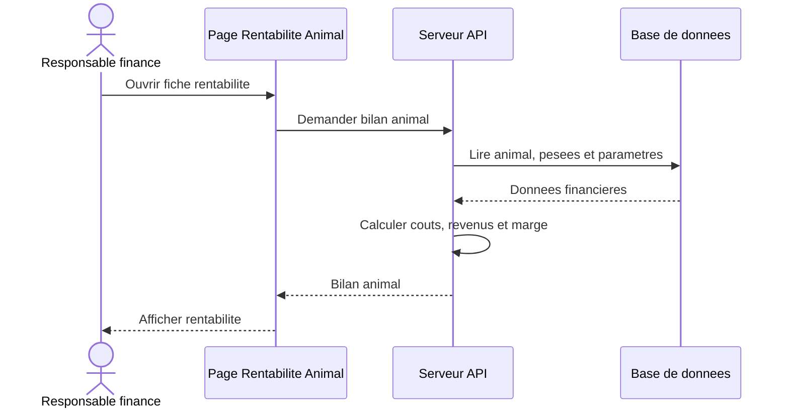

# Diagramme de sequence - Rentabilite animal

```mermaid
sequenceDiagram
    actor Responsable as Responsable finance
    participant Interface as Page Rentabilite Animal
    participant Serveur as Serveur API
    participant DB as Base de donnees

    Responsable->>Interface: Ouvrir fiche rentabilite
    Interface->>Serveur: Demander bilan animal
    Serveur->>DB: Lire animal, pesees et parametres
    DB-->>Serveur: Donnees financieres
    Serveur->>Serveur: Calculer couts, revenus et marge
    Serveur-->>Interface: Bilan animal
    Interface-->>Responsable: Afficher rentabilite
```

