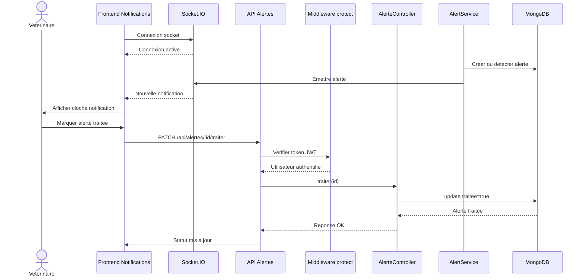

# Diagramme de sequence - Alertes temps reel

```mermaid
sequenceDiagram
    actor Veterinaire
    participant Frontend as Frontend Notifications
    participant Socket as Socket.IO
    participant API as API Alertes
    participant Middleware as Middleware protect
    participant Controller as AlerteController
    participant Alertes as AlertService
    participant DB as MongoDB

    Frontend->>Socket: Connexion socket
    Socket-->>Frontend: Connexion active
    Alertes->>DB: Creer ou detecter alerte
    Alertes->>Socket: Emettre alerte
    Socket-->>Frontend: Nouvelle notification
    Frontend-->>Veterinaire: Afficher cloche notification
    Veterinaire->>Frontend: Marquer alerte traitee
    Frontend->>API: PATCH /api/alertes/:id/traiter
    API->>Middleware: Verifier token JWT
    Middleware-->>API: Utilisateur authentifie
    API->>Controller: traiter(id)
    Controller->>DB: update traitee=true
    DB-->>Controller: Alerte traitee
    Controller-->>API: Reponse OK
    API-->>Frontend: Statut mis a jour
```

