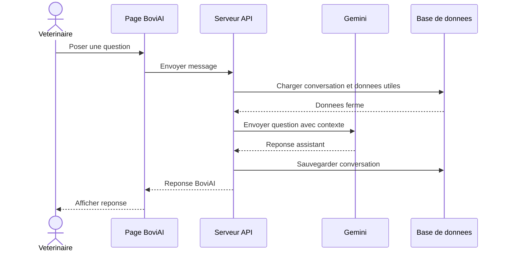

# Diagramme de sequence - Chat BoviAI

```mermaid
sequenceDiagram
    actor Veterinaire
    participant Interface as Page BoviAI
    participant Serveur as Serveur API
    participant Gemini as Gemini
    participant DB as Base de donnees

    Veterinaire->>Interface: Poser une question
    Interface->>Serveur: Envoyer message
    Serveur->>DB: Charger conversation et donnees utiles
    DB-->>Serveur: Donnees ferme
    Serveur->>Gemini: Envoyer question avec contexte
    Gemini-->>Serveur: Reponse assistant
    Serveur->>DB: Sauvegarder conversation
    Serveur-->>Interface: Reponse BoviAI
    Interface-->>Veterinaire: Afficher reponse
```

