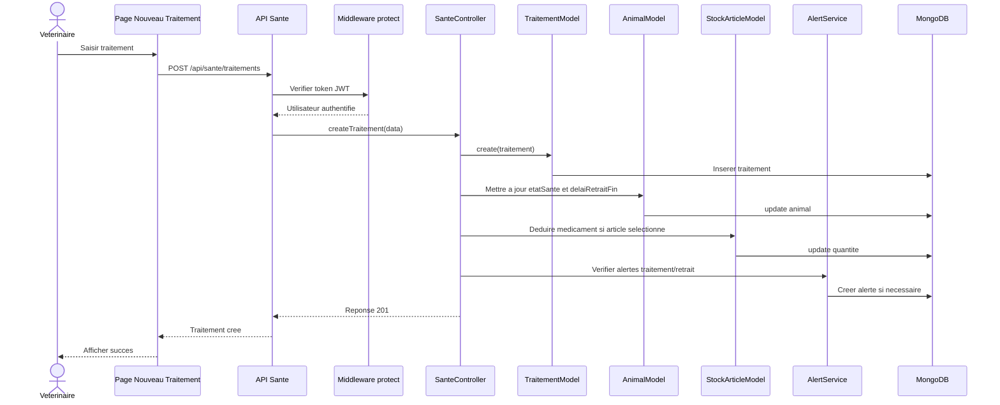

# Diagramme de sequence - Creation traitement

```mermaid
sequenceDiagram
    actor Veterinaire
    participant Frontend as Page Nouveau Traitement
    participant API as API Sante
    participant Middleware as Middleware protect
    participant Controller as SanteController
    participant Traitement as TraitementModel
    participant Animal as AnimalModel
    participant Stock as StockArticleModel
    participant Alertes as AlertService
    participant DB as MongoDB

    Veterinaire->>Frontend: Saisir traitement
    Frontend->>API: POST /api/sante/traitements
    API->>Middleware: Verifier token JWT
    Middleware-->>API: Utilisateur authentifie
    API->>Controller: createTraitement(data)
    Controller->>Traitement: create(traitement)
    Traitement->>DB: Inserer traitement
    Controller->>Animal: Mettre a jour etatSante et delaiRetraitFin
    Animal->>DB: update animal
    Controller->>Stock: Deduire medicament si article selectionne
    Stock->>DB: update quantite
    Controller->>Alertes: Verifier alertes traitement/retrait
    Alertes->>DB: Creer alerte si necessaire
    Controller-->>API: Reponse 201
    API-->>Frontend: Traitement cree
    Frontend-->>Veterinaire: Afficher succes
```

