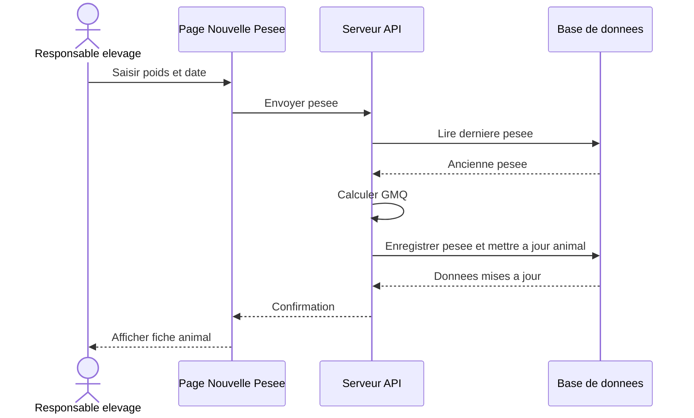

# Diagramme de sequence - Ajout pesee

```mermaid
sequenceDiagram
    actor Responsable as Responsable elevage
    participant Interface as Page Nouvelle Pesee
    participant Serveur as Serveur API
    participant DB as Base de donnees

    Responsable->>Interface: Saisir poids et date
    Interface->>Serveur: Envoyer pesee
    Serveur->>DB: Lire derniere pesee
    DB-->>Serveur: Ancienne pesee
    Serveur->>Serveur: Calculer GMQ
    Serveur->>DB: Enregistrer pesee et mettre a jour animal
    DB-->>Serveur: Donnees mises a jour
    Serveur-->>Interface: Confirmation
    Interface-->>Responsable: Afficher fiche animal
```

