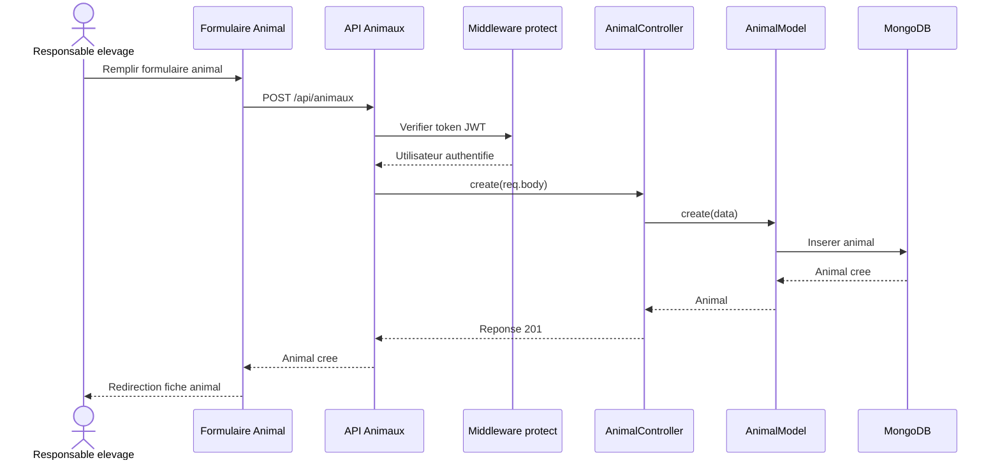

# Diagramme de sequence - Creation animal

```mermaid
sequenceDiagram
    actor Responsable as Responsable elevage
    participant Frontend as Formulaire Animal
    participant API as API Animaux
    participant Middleware as Middleware protect
    participant Controller as AnimalController
    participant Animal as AnimalModel
    participant DB as MongoDB

    Responsable->>Frontend: Remplir formulaire animal
    Frontend->>API: POST /api/animaux
    API->>Middleware: Verifier token JWT
    Middleware-->>API: Utilisateur authentifie
    API->>Controller: create(req.body)
    Controller->>Animal: create(data)
    Animal->>DB: Inserer animal
    DB-->>Animal: Animal cree
    Animal-->>Controller: Animal
    Controller-->>API: Reponse 201
    API-->>Frontend: Animal cree
    Frontend-->>Responsable: Redirection fiche animal
```

