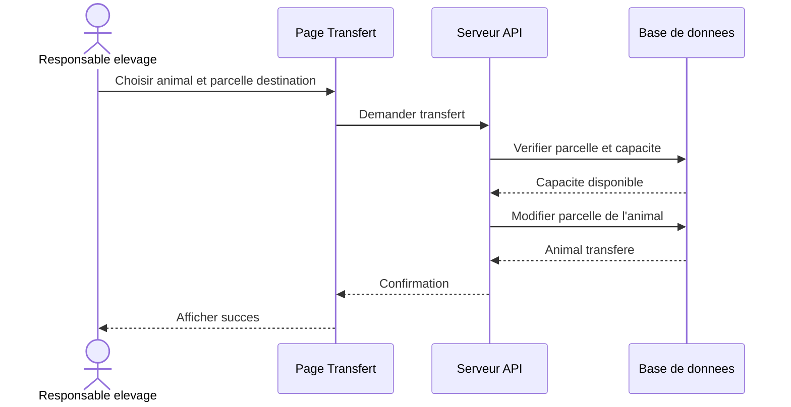

# Diagramme de sequence - Transfert parcelle

```mermaid
sequenceDiagram
    actor Responsable as Responsable elevage
    participant Interface as Page Transfert
    participant Serveur as Serveur API
    participant DB as Base de donnees

    Responsable->>Interface: Choisir animal et parcelle destination
    Interface->>Serveur: Demander transfert
    Serveur->>DB: Verifier parcelle et capacite
    DB-->>Serveur: Capacite disponible
    Serveur->>DB: Modifier parcelle de l'animal
    DB-->>Serveur: Animal transfere
    Serveur-->>Interface: Confirmation
    Interface-->>Responsable: Afficher succes
```

