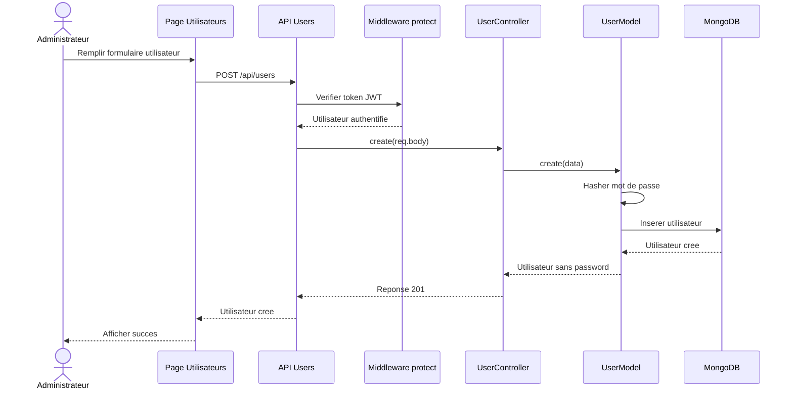

# Diagramme de sequence - Creation utilisateur

```mermaid
sequenceDiagram
    actor Administrateur
    participant Frontend as Page Utilisateurs
    participant API as API Users
    participant Middleware as Middleware protect
    participant Controller as UserController
    participant User as UserModel
    participant DB as MongoDB

    Administrateur->>Frontend: Remplir formulaire utilisateur
    Frontend->>API: POST /api/users
    API->>Middleware: Verifier token JWT
    Middleware-->>API: Utilisateur authentifie
    API->>Controller: create(req.body)
    Controller->>User: create(data)
    User->>User: Hasher mot de passe
    User->>DB: Inserer utilisateur
    DB-->>User: Utilisateur cree
    User-->>Controller: Utilisateur sans password
    Controller-->>API: Reponse 201
    API-->>Frontend: Utilisateur cree
    Frontend-->>Administrateur: Afficher succes
```

