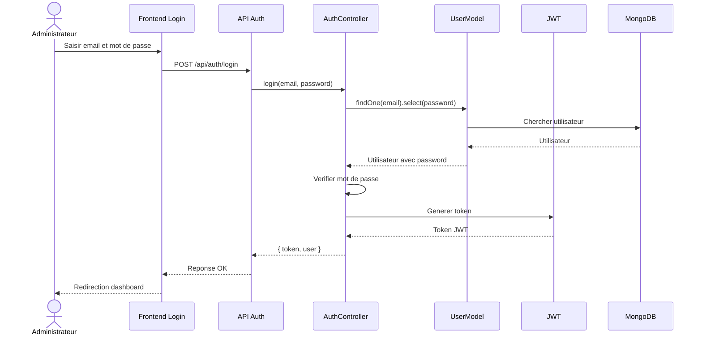

# Diagramme de sequence - Connexion

```mermaid
sequenceDiagram
    actor Administrateur
    participant Frontend as Frontend Login
    participant API as API Auth
    participant Auth as AuthController
    participant User as UserModel
    participant JWT as JWT
    participant DB as MongoDB

    Administrateur->>Frontend: Saisir email et mot de passe
    Frontend->>API: POST /api/auth/login
    API->>Auth: login(email, password)
    Auth->>User: findOne(email).select(password)
    User->>DB: Chercher utilisateur
    DB-->>User: Utilisateur
    User-->>Auth: Utilisateur avec password
    Auth->>Auth: Verifier mot de passe
    Auth->>JWT: Generer token
    JWT-->>Auth: Token JWT
    Auth-->>API: { token, user }
    API-->>Frontend: Reponse OK
    Frontend-->>Administrateur: Redirection dashboard
```

