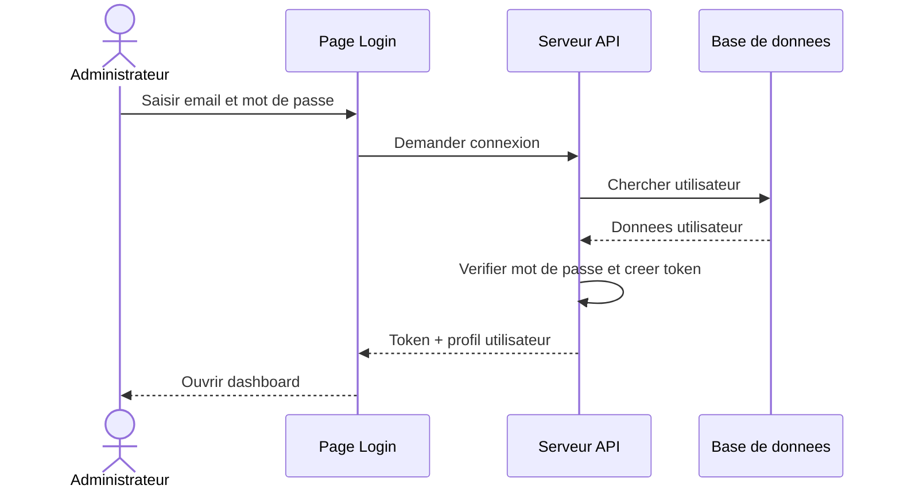

# Diagramme de sequence - Connexion

```mermaid
sequenceDiagram
    actor Administrateur
    participant Interface as Page Login
    participant Serveur as Serveur API
    participant DB as Base de donnees

    Administrateur->>Interface: Saisir email et mot de passe
    Interface->>Serveur: Demander connexion
    Serveur->>DB: Chercher utilisateur
    DB-->>Serveur: Donnees utilisateur
    Serveur->>Serveur: Verifier mot de passe et creer token
    Serveur-->>Interface: Token + profil utilisateur
    Interface-->>Administrateur: Ouvrir dashboard
```

