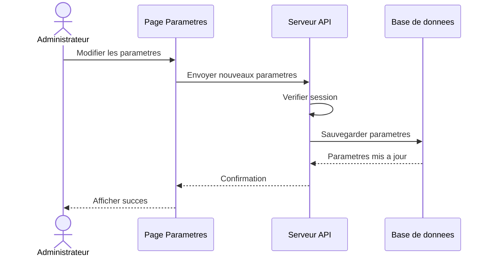

# Diagramme de sequence - Modification parametres

```mermaid
sequenceDiagram
    actor Administrateur
    participant Interface as Page Parametres
    participant Serveur as Serveur API
    participant DB as Base de donnees

    Administrateur->>Interface: Modifier les parametres
    Interface->>Serveur: Envoyer nouveaux parametres
    Serveur->>Serveur: Verifier session
    Serveur->>DB: Sauvegarder parametres
    DB-->>Serveur: Parametres mis a jour
    Serveur-->>Interface: Confirmation
    Interface-->>Administrateur: Afficher succes
```

