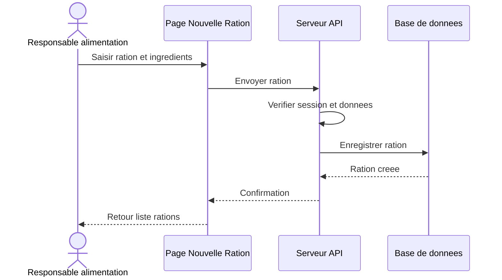

# Diagramme de sequence - Creation ration

```mermaid
sequenceDiagram
    actor Responsable as Responsable alimentation
    participant Interface as Page Nouvelle Ration
    participant Serveur as Serveur API
    participant DB as Base de donnees

    Responsable->>Interface: Saisir ration et ingredients
    Interface->>Serveur: Envoyer ration
    Serveur->>Serveur: Verifier session et donnees
    Serveur->>DB: Enregistrer ration
    DB-->>Serveur: Ration creee
    Serveur-->>Interface: Confirmation
    Interface-->>Responsable: Retour liste rations
```

