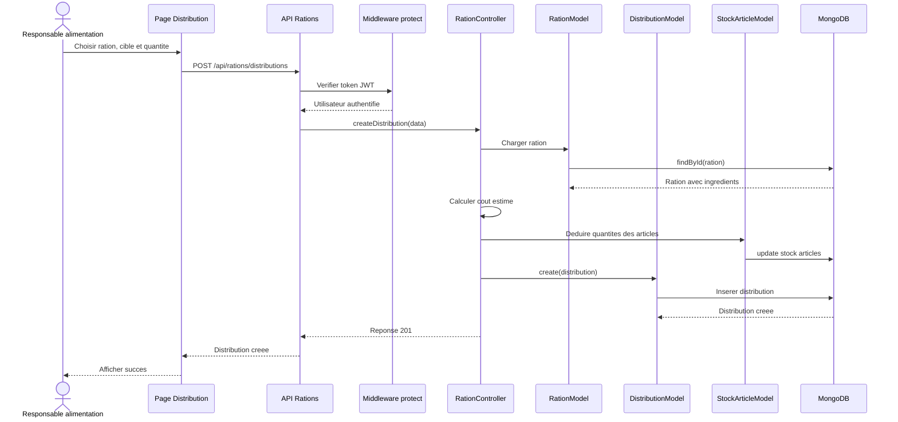

# Diagramme de sequence - Distribution ration

```mermaid
sequenceDiagram
    actor Responsable as Responsable alimentation
    participant Frontend as Page Distribution
    participant API as API Rations
    participant Middleware as Middleware protect
    participant Controller as RationController
    participant Ration as RationModel
    participant Distribution as DistributionModel
    participant Stock as StockArticleModel
    participant DB as MongoDB

    Responsable->>Frontend: Choisir ration, cible et quantite
    Frontend->>API: POST /api/rations/distributions
    API->>Middleware: Verifier token JWT
    Middleware-->>API: Utilisateur authentifie
    API->>Controller: createDistribution(data)
    Controller->>Ration: Charger ration
    Ration->>DB: findById(ration)
    DB-->>Ration: Ration avec ingredients
    Controller->>Controller: Calculer cout estime
    Controller->>Stock: Deduire quantites des articles
    Stock->>DB: update stock articles
    Controller->>Distribution: create(distribution)
    Distribution->>DB: Inserer distribution
    DB-->>Distribution: Distribution creee
    Controller-->>API: Reponse 201
    API-->>Frontend: Distribution creee
    Frontend-->>Responsable: Afficher succes
```

