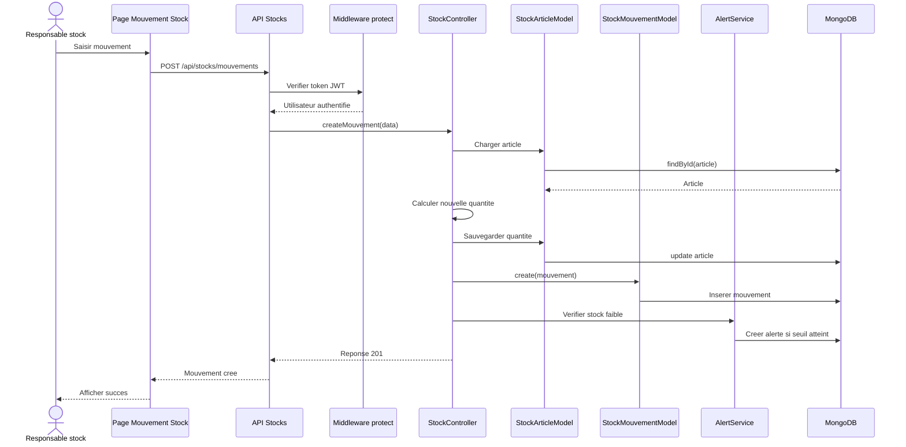

# Diagramme de sequence - Mouvement de stock

```mermaid
sequenceDiagram
    actor Responsable as Responsable stock
    participant Frontend as Page Mouvement Stock
    participant API as API Stocks
    participant Middleware as Middleware protect
    participant Controller as StockController
    participant Article as StockArticleModel
    participant Mouvement as StockMouvementModel
    participant Alertes as AlertService
    participant DB as MongoDB

    Responsable->>Frontend: Saisir mouvement
    Frontend->>API: POST /api/stocks/mouvements
    API->>Middleware: Verifier token JWT
    Middleware-->>API: Utilisateur authentifie
    API->>Controller: createMouvement(data)
    Controller->>Article: Charger article
    Article->>DB: findById(article)
    DB-->>Article: Article
    Controller->>Controller: Calculer nouvelle quantite
    Controller->>Article: Sauvegarder quantite
    Article->>DB: update article
    Controller->>Mouvement: create(mouvement)
    Mouvement->>DB: Inserer mouvement
    Controller->>Alertes: Verifier stock faible
    Alertes->>DB: Creer alerte si seuil atteint
    Controller-->>API: Reponse 201
    API-->>Frontend: Mouvement cree
    Frontend-->>Responsable: Afficher succes
```

